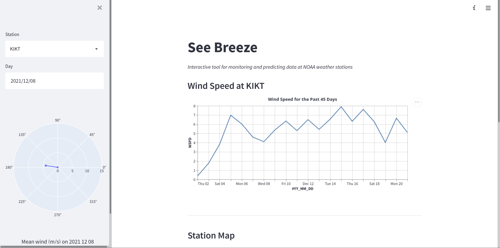

# See Breeze

## Installation and Running

- Clone the repository
- `pip install < requirements.txt`
- `streamlit run main.py`

## Team

-	[Michael Wong](https://github.com/DonMiguel808)
-	[Nat Hill](https://github.com/nat-hill)
-	[Shreyas Minocha](https://github.com/shreyasminocha)
-	[Zachary Katz](https://github.com/unary-code)
